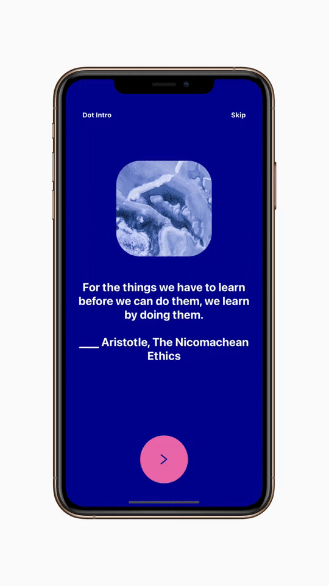

# React Native Dot Intro

This react native module is intended to provide a beautifully animated onboarding screen that you can customise and use in your own projects.



## Usage


### Example Usage
```
import * as React from "react";
import { View } from "react-native";
import RNDotIntro from "react-native-dot-intro";

const colors = [{
    arrowColor: "#000B92",
    textColor: "white",
    initialBgColor: "#000B92",
    bgColor: "#F576AA",
    nextBgColor: "#F576AA",
  },];

const contents = [{
    image: { uri: "https://reactnative.dev/img/tiny_logo.png" },
    text: "Welcome to my app",
  },];

export default function App() {
  return (
    <View
      style={{
        flex: 1,
      }}
    >
      <RNDotIntro
        colors={colors}
        contents={contents}
        imageWidth={200}
        imageHeight={200}
        onEnd={() => {console.log("Handle onEnd e.g. navigate to app")}}
        title="Dot Intro"
      />
    </View>
  );
}

```

## Props

|Name|Type|Default|Required|Description|
|---|---|---|---|---|
|colors|object|None|True|An array of objects `{ arrowColor: "#000B92", textColor: "white", initialBgColor: "#000B92", bgColor: "#F576AA", nextBgColor: "#F576AA"}` a mixture of hexcodes and color names may be used see [React Native Default Colors](https://reactnative.dev/docs/colors).<br/><br/>initialBgColor -> Big background of the element<br/>bgColor -> initial circle bg color that will be the next slide initial BG Color<br/>nextBgColor -> next circle bg color after we fully transition the circle and this will be small again</br>prev bgColor === next initialBgColor<br/>prev nextBgColor === next bgColor|
|contents|object|None|True|An array of objects `{image: { uri: "https://reactnative.dev/img/tiny_logo.png" }, text: "For the things we have to learn before we can do them, we learn by doing them.\n\n___ Aristotle, The Nicomachean Ethics"}`. Image object may contain a uri or you may pass a local image using `require('../path/to/image')`.|
|duration|number|1000|False|Duration of the transition animation|
|imageWidth|number|125|False|Width of the image|
|imageHeight|number|125|False|Height of image|
|onEnd|Function|None|True|A function that is called when the app intro component is finished or you the user has opted to skip (if enabled)|
|textDuration|number|800|False|Duration of the text transition animation|
|titles|array|None|False|Name of your App or alternatively the title of this section of your app|
|skip|boolean|true|False|Boolean to enable or disable the skip button. If enabled and pressed onEnd function will be called.|

## 🚀 Run the example
The provided example uses [expo](https://expo.io/). Navigate to the "example" directory and run:

- Install packages with `yarn` or `npm install`.
  - If you have native iOS code run `npx pod-install`
- Run `yarn start` to start the bundler.
- Open the project in a React runtime to try it:
  - iOS: [Client iOS](https://itunes.apple.com/app/apple-store/id982107779)
  - Android: [Client Android](https://play.google.com/store/apps/details?id=host.exp.exponent&referrer=blankexample)
  - Web: Any web browser


## Credit

Credit goes to Catalin Miron for providing both an insightful [tutorial](https://youtu.be/vQNg06Hf0MQ) and also the [source code](https://github.com/catalinmiron/react-native-dot-inversion) on which this module is based off of.

Credit also goes to Cuberto for making this concept avaliable. The dribble can be found [here](https://dribbble.com/shots/6654320-Animated-Onboarding-Screens)
